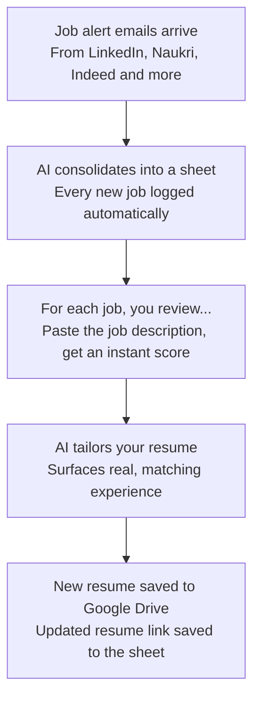

# auto-job-applicator-n8n
A free, no-code n8n workflow that automates the time-consuming parts of job hunting — reading job-alert emails, scoring how well a job matches your resume, and tailoring your resume for the jobs you choose to apply to. You still click "Apply" yourself, on your own terms, for reasons explained below.

Built as a companion to the **Bottomline with Aditya** YouTube video — watch the video first, then use this README to build it yourself, step by step.

## Why this is semi-automated, not fully automated

LinkedIn (and most job portals) explicitly prohibit bots that scrape pages or automate logins/actions in their User Agreement, and actively detect and ban accounts that try. So this project draws a clear line:

- **Fully automated, zero risk:** reading your own inbox, writing to your own spreadsheet, and asking an AI model to reason over text. None of this touches a job portal's platform.
- **Manual, by design:** opening a job link and copying its description, and clicking Apply. A human browsing a public page and reading it is completely normal use of a website — a script fetching hundreds of pages automatically is the behavior platforms are built to detect and block. Keeping these two steps manual is what keeps your account safe.

The result: you still do a *little* clicking and pasting, but everything slow and repetitive — tracking, scoring, and resume tailoring — runs on its own.

## The flow, at a glance



This README covers everything up through the last box — a tailored resume saved to Drive with its link written back to your sheet. Feel free to get more creative from here - things like tracking your application, updating the google sheet if applied or not, refining the logic to remove potential duplicates (and more).

## What you'll have by the end

- n8n running free on your own machine (Mac or Windows)
- A Google Sheet acting as your job tracker
- **Workflow 1 — Consolidate:** turns job-alert emails from multiple portals into tracker rows
- **Workflow 2 — Match & Score:** a bookmarkable webpage where you paste a job description and get an instant fit score, missing skills, and resume suggestions
- **Workflow 3 — Tailor & Save:** a bookmarkable webpage where you paste a job link for jobs you've decided to apply to, and get a tailored resume copy saved to Google Drive

- Workflows 2 and 3 can be combined (as shown in the YouTube video)

---

## Prerequisites

- A Mac or Windows PC, admin rights to install software
- A Google account (Gmail + Sheets + Drive)
- A free Google account for Gemini API access (no credit card required)
- ~30–45 minutes for first-time setup

---

## Step 1 — Install Docker Desktop

<details>
<summary><b>macOS</b></summary>

1. Download Docker Desktop from [docker.com/products/docker-desktop](https://www.docker.com/products/docker-desktop/) — choose Apple Silicon or Intel depending on your Mac's chip.
2. Install it, then open it once and confirm the whale icon appears in your menu bar. No account or payment required for local use.

</details>

<details>
<summary><b>Windows</b></summary>

1. Download Docker Desktop for Windows from [docker.com/products/docker-desktop](https://www.docker.com/products/docker-desktop/).
2. Docker Desktop on Windows requires the WSL2 backend — the installer will prompt you to enable it if it isn't already (this may require a restart).
3. After install, open Docker Desktop and confirm it shows "Engine running" in the bottom-left corner.

</details>

---

## Step 2 — Run n8n

<details>
<summary><b>macOS (Terminal)</b></summary>

```bash
docker run -it --rm --name n8n -p 5678:5678 -v n8n_data:/home/node/.n8n docker.n8n.io/n8nio/n8n
```

Leave this Terminal window open — it's your running server. Open [http://localhost:5678](http://localhost:5678) in your browser and create your local n8n owner login (stays on your machine).

</details>

<details>
<summary><b>Windows (PowerShell)</b></summary>

```powershell
docker run -it --rm --name n8n -p 5678:5678 -v n8n_data:/home/node/.n8n docker.n8n.io/n8nio/n8n
```

Same command, run in PowerShell with Docker Desktop open. Leave the window open, then visit [http://localhost:5678](http://localhost:5678) and create your local owner login.

</details>

**Tip:** once comfortable, replace `-it` with `-d` to run it detached (in the background) without keeping a terminal window open.

---

## Step 3 — Set up your Google Cloud project

This unlocks Gmail, Sheets, Drive, and Docs access for n8n.

1. Go to [console.cloud.google.com](https://console.cloud.google.com) and sign in with the Google account you want this to use.
2. Click the project dropdown (top bar) → **New Project** → name it e.g. `n8n-job-agent` → Create.
3. With that project selected, go to **APIs & Services → Library** and enable all four of these (search and click Enable on each):
   - Gmail API
   - Google Sheets API
   - Google Drive API
   - Google Docs API

---

## Step 4 — Configure the OAuth consent screen

1. Go to **APIs & Services → OAuth consent screen** (in newer console layouts this may appear under an **Audience** tab).
2. Choose **External** as the user type.
3. Fill in the required fields (App name, your email as support/developer contact).
4. You can skip manually adding scopes — n8n requests them at login.
5. On **Test users**, click **Add Users** and add your own Google account's email address. While the app is in "Testing" (unpublished) status, only accounts on this list can authorize it — this includes you, even though you're the developer.

> **Known gotcha:** if sign-in fails with **"Error 403: access_denied"**, it almost always means your email wasn't added as a test user here. Add it, wait a minute, and retry.

> **Known limitation:** while in Testing mode, OAuth tokens for sensitive scopes (Gmail included) expire after 7 days, requiring you to reconnect the credential in n8n weekly. The permanent fix is completing Google's app verification — more setup, one-time cost, optional for personal use.

---

## Step 5 — Create your OAuth Client ID

1. In n8n, start adding any Google credential (e.g. Gmail OAuth2) and copy the **OAuth Redirect URL** it shows you (typically `http://localhost:5678/rest/oauth2-credential/callback`).
2. In Google Cloud Console: **APIs & Services → Credentials → Create Credentials → OAuth client ID** → Application type: **Web application**.
3. Paste the redirect URL under **Authorized redirect URIs** → Create.
4. Google shows your **Client ID** and **Client Secret** — copy both.

---

## Step 6 — Connect credentials in n8n

You'll reuse the same Client ID/Secret across four separate n8n credentials, authorizing each individually:

| Credential type | Used by |
|---|---|
| Gmail OAuth2 | Reading job-alert emails |
| Google Sheets OAuth2 | The job tracker |
| Google Drive OAuth2 | Copying the resume template |
| Google Docs OAuth2 | Reading/editing the tailored resume |

For each one: **Credentials → Add Credential**, select the type, paste in your Client ID/Secret, click **Connect my account**, and approve access. You'll likely see a "Google hasn't verified this app" warning — expected, since the app is in Testing mode. Click **Advanced → Go to (your app name) (unsafe)** to proceed.

---

## Step 7 — Get a free Gemini API key

1. Go to [aistudio.google.com/app/apikey](https://aistudio.google.com/app/apikey) (sign in with your Google account).
2. Click **Create API key** — no billing details required.
3. In n8n, add a **Google Gemini** credential (**Credentials → Add Credential → Google Gemini**) and paste the key in.

---

## Step 8 — Build the Job Tracker spreadsheet

Create a new Google Sheet named `Job Tracker` with this header row (exact column names, in order):

```
Date Added | Job Title | Company | Work Location | Apply Link | JD Text | Fit % | To Apply | Missing Skills | Suggestions | Tailored Resume Link
```

> Note: if you extend this project later with your own "confirmation tracking" workflow, you'll want to add a `Status` column too — it's intentionally left out here since this README stops before that step.

---

## Step 9 — Turn on job alerts

On each portal you want (LinkedIn, Naukri, Indeed, Shine, FoundIt, Instahyre), search your target role + location/remote filters, save the search, and turn on **email alerts** at the most frequent setting available. This is a native feature of each site — no automation involved — and is what feeds Workflow 1.

---

## Workflow 1 — Consolidate

**Goal:** turn new job-alert emails into tracker rows automatically.

| Node | Configuration |
|---|---|
| **Gmail Trigger** | Search: `from:(linkedin.com OR naukri.com OR indeed.com OR shine.com OR foundit.in OR instahyre.com) (job OR jobs OR alert OR recommend)`. Read Status: Unread and read emails (safer while testing). Poll: every 1 minute. |
| **Gmail** (Get Message) | Resource: Message, Operation: Get, Message ID: `{{ $json.id }}`, Simplify: ON |
| **AI Agent — Parser** | System Message: prompt below. Prompt (User Message): `{{ $json.text }}` (or `{{ $json.html }}` if the plain-text body is thin) |
| **Set / Edit Fields** | New field `jobs` (type Array), value: `{{ JSON.parse($json.output.replace(/\`\`\`json\n?/g, '').replace(/\`\`\`\n?/g, '').trim()) }}` |
| **Split Out** | Field to Split Out: `jobs` |
| **Google Sheets — Append Row** | Date Added = `{{ $now }}`, plus Job Title / Company / Work Location / Apply Link mapped from the split item's fields (check the exact field path in the node's output before mapping) |

**Parser system prompt:**
```
You will be given the raw text of a job-alert email from a job portal
(LinkedIn, Naukri, Indeed, Shine, FoundIt, Instahyre, or similar), which may
list multiple jobs. Extract every distinct listing. For each, return a JSON
object with: job_title, company, location, apply_link. Return a JSON array
only, no commentary, no markdown code fences. Use null for any field you
can't confidently extract - never guess.
```

---

## Workflow 2 — Match & Score

**Why this step is manual:** LinkedIn and similar portals don't include the full job description in alert emails, and automatically fetching each job's page to scrape it would violate their terms and risk your account — this is the same automated-access restriction covered in "Why this is semi-automated." So you open the link yourself (completely normal browsing), copy the description, and paste it into this form — a few seconds of manual work that keeps the whole project on the right side of every portal's rules.

| Node | Configuration |
|---|---|
| **Form Trigger** | Fields: "Apply Link" (short text), "Paste the job description here" (long text) |
| **Google Sheets — Search Row** | Match by Apply Link |
| **AI Agent — Match & Score** | System Message: prompt below. Feed it your resume text + the found row + the pasted JD |
| **Google Sheets — Update Row** | JD Text = pasted text, Fit % = `fit_percentage`, To Apply = `{{ $json.fit_percentage >= 60 ? "Yes" : "No" }}`, Missing Skills, Suggestions |
| **Respond to Webhook** | Shows the score/suggestions back on the form page |

**Match & Score system prompt:**
```
You are evaluating job fit honestly for a Data Analyst candidate. You will
receive CANDIDATE_RESUME and JOB_DESCRIPTION. Return, as clean JSON only
(no markdown fences): fit_percentage (0-100, based only on real evidence in
the resume matching this JD's stated requirements), matched_skills (array),
missing_skills (array - things the JD asks for that the resume never
mentions), language_notes (JD keywords/phrasing worth mirroring in the
resume), suggested_changes (array of 1-3 short instructions for edits that
surface EXISTING real experience - never invent a skill, tool, number, or
achievement not already in the resume). Be conservative with
fit_percentage - a generic overlap is not a strong match.
```

> Fit % is the model's best judgment, not a precise metric — treat 60% as "worth a closer look," not a scientific cutoff.

Once this workflow is Active, click the Form Trigger node and copy its **Production URL** (not the Test URL) — bookmark it. This is your daily "paste a JD here" page.

---

## Workflow 3 — Tailor & Save

**Setup first:** copy your resume content into a **Google Doc** (not just a .docx), keeping your real formatting (headers, bold, bullets). Inside each editable chunk, replace the actual sentence with a short token — your summary paragraph becomes `{{SUMMARY}}`, and each experience bullet becomes `{{BULLET_1}}`, `{{BULLET_2}}`, etc. — each token still sitting inside its own already-formatted line. This is what lets the workflow swap in new wording without destroying your layout.

| Node | Configuration |
|---|---|
| **Form Trigger** | Field: "Apply Link" |
| **Google Sheets — Search Row** | Pull JD Text, Missing Skills, Suggestions, Job Title, Company |
| **Google Drive — Copy File** | Copy your master resume Doc, new name = `Resume - {{Company}} - {{Job Title}}` |
| **Google Docs — Get** | Read the copy's text |
| **AI Agent — Resume Tailor** | System Message: prompt below |
| **Google Docs — Update** | One "Replace Text" action per token (Text to Find = `{{SUMMARY}}`, `{{BULLET_1}}`, etc.; Replace With = the matching field from the AI output) |
| **Google Sheets — Update Row** | Tailored Resume Link = `https://docs.google.com/document/d/{{ documentId }}/edit` (use the exact field name/path the Drive Copy File node returned — check its output before wiring) |

**Resume Tailor system prompt:**
```
You will receive ORIGINAL_RESUME, JOB_DESCRIPTION, MISSING_SKILLS,
SUGGESTIONS, and LANGUAGE_NOTES. Rewrite each section to better match this
specific job: reorder or rephrase EXISTING content to lead with the most
relevant real experience, mirror the JD's own terminology where the
underlying skill genuinely matches, and apply the given suggestions. Do NOT
add any skill, tool, metric, or achievement not already present in
ORIGINAL_RESUME. If a missing skill genuinely isn't in the resume, leave it
out rather than fabricating it. Return clean JSON with one field per
section/bullet token (e.g. "summary", "bullet_1" ... "bullet_6"), ready to
slot directly into the matching placeholder.
```

> This preserves your wording and formatting (via the placeholder swap), not a full rewrite — the AI can't add or drop a bullet, only rephrase within each fixed slot. That's a deliberate constraint, not a limitation: you already wrote the real, honest content; this just resurfaces it for a specific job.

Once Active, bookmark this workflow's Form Trigger **Production URL** too — this is where you paste the Apply Link for jobs you've decided to go after.

---

## Your daily loop

1. Workflow 1 has already logged new jobs overnight.
2. Open your Workflow 2 bookmark for each promising job: open the link, paste the JD, get your fit score.
3. For your "Yes" picks, open your Workflow 3 bookmark and paste the Apply Link — get a tailored, properly formatted resume saved to Drive.
4. Apply, using the tailored resume, through the portal's own normal Apply flow.

---

## Troubleshooting

- **Gmail Trigger only catches 1 of several new emails:** check the Executions tab — it may genuinely have fired once per email (normal). Also check "Max Emails per Poll" wasn't accidentally set to 1, and that Read Status includes read emails if you'd already opened some while testing.
- **Combined sender filter doesn't work:** don't put a multi-sender OR list into the "Sender" field (it expects one value). Put the full query, including `from:(...)`, into the **Search** field instead.
- **AI Agent returns 0 results:** check that the Prompt (User Message) field actually references the email body (`{{ $json.text }}`), not left blank or pointing at the wrong node.
- **Split Out only shows one field called "output" with the whole text:** the AI Agent's response is a raw string, not real JSON yet — add a Set node with a `JSON.parse(...)` expression before Split Out (see Workflow 1's node table).
- **"Error 403: access_denied" during Google sign-in:** your account isn't on the OAuth consent screen's Test Users list yet — add it there.
- **Form's Production URL shows "Problem loading form":** the workflow isn't Active/Published yet — check the toggle or Publish button in the top-right of that workflow's editor, or activate it from the Workflows list page.
- **Tailored resume loses formatting:** you're replacing the whole document body instead of using the placeholder-token approach in Workflow 3 — switch to per-section tokens and Replace Text actions.

---

## Cost

n8n, Gmail, Sheets, Drive, Docs: **$0**. Gemini API free tier: **$0**, no card required. The only cost is your time setting it up once.

## What this intentionally doesn't do

It doesn't log into any job portal as a bot, doesn't auto-click Apply, and doesn't scrape job pages in bulk. It removes the slow, repetitive parts — reading, scoring, tailoring — while keeping the two actions platforms actually watch for (viewing a specific job, submitting an application) entirely in your own hands, as a human, on your own account.
